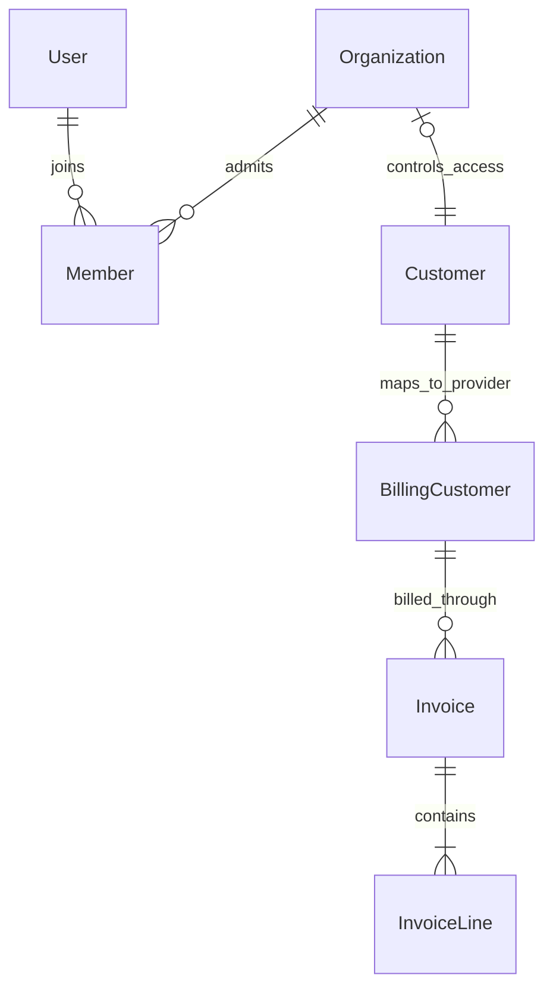

# Customer accounts and access

The account slice provides protected customer profiles and membership management. A customer has a stable UUID and one access organization. A person can belong to several customers. Staff grants are separate from customer membership. Customer creation and staff bootstrap are explicit operator tasks; this slice has no browser account-creation route, impersonation or role editor.

The existing anonymous synthetic viewer remains a separate application composition. The authenticated portal uses real sessions with reviewed synthetic records. Google and Microsoft configuration is supported but requires provider credentials and separate actual sign-in verification. A local passwordless email-link flow is available only in the isolated synthetic portal and delivers to a local mailbox sink with external relay disabled. It does not establish production email-link authentication readiness.

## Ownership and interfaces

| Location                                     | Owns                                                                                                                                     |
| -------------------------------------------- | ---------------------------------------------------------------------------------------------------------------------------------------- |
| `src/access/contract.ts`                     | Browser-safe session, membership, invitation, command and error schemas                                                                  |
| `src/access/types.ts`                        | Server-resolved actor, current authorization, transactional audit and authentication adapter interfaces                                  |
| `src/access/index.ts`, `internal/`           | Access policy, staff grants, invitation/member facade, authorization checks and audit persistence                                        |
| Access authentication adapter and its schema | Better Auth configuration, framework-owned identity/session/organization tables and the narrowly reviewed invitation/member writes below |
| `src/customers/contract.ts`, `types.ts`      | Customer profile/read schemas, commands and the scoped customer interface                                                                |
| `src/customers/index.ts`, `internal/`        | Stable operational customers, mutable profiles, version checks and profile audit transactions                                            |
| `src/billing/`                               | Provider mappings and immutable invoice snapshots; customer-scoped invoice queries                                                       |
| `src/server/`                                | Authentication transport, trusted origins, route composition, synthetic policy and safe errors                                           |

Better Auth owns identity, provider-account links, session verification, mailbox verification and invitation acceptance. OAuth access and refresh tokens use Better Auth's built-in encryption. Account persistence hooks discard ID tokens because the portal needs them only during provider verification, not after sign-in. Real Google/Microsoft acceptance remains pending credentials. Domain modules receive `HumanActor`, consisting only of user ID and session ID. They never receive provider tokens, HTTP cookies or client-provided roles. Browser code imports the two contract files only. Customer/domain modules do not import Better Auth or query its private tables. Access depends on an injected customer-ID-to-organization lookup rather than importing customer implementation, avoiding a module cycle.

`createAccess(options: AccessOptions): Access` accepts a PostgreSQL pool, authentication gateway, customer-target lookup, invitation policy and enabled sign-in configuration. It exposes the policy and audit writer consumed by `createCustomers(options: CustomersOptions): Customers`. Factories perform no customer lookup during construction, so composition may supply a closure over the subsequently constructed customers module. The gateway maps supported Better Auth session and invitation-acceptance APIs to plain values. Concrete constructors are exported from each module's index; the exact public types are in the linked `types.ts` files.

The customer module exposes `listCustomers`, `getCustomer`, `updateCustomer`, `getAccessTarget` and `authorizeCustomer`. `getAccessTarget` exposes only customer/organization identifiers for server composition and grants no access. The access facade exposes `resolveActor`, `getSession`, `listMembers`, `listInvitations`, `inviteMember`, `acceptInvitation`, `revokeInvitation` and `revokeMember`. Only the access facade receives request headers, because it calls the authentication library; business domain methods receive the resolved actor. Expected denials return `AccessResult` with a safe code. Persistence failures become unavailable responses without SQL, tokens or raw provider errors.

## Current authority and customer scope

An actor identifies the current authenticated human and is never a cached authorization result. `AccessPolicy.readScope(actor)` verifies an unexpired, existing session and resolves current staff grants or organization memberships. A staff scope is deliberately all customers allowed by the staff role; a membership scope contains permitted organization IDs. Customer list queries apply that scope before pagination/counting in PostgreSQL. An ordinary customer's detail lookup includes the same scope, returning not found for a foreign customer to avoid exposing its existence. Selecting an organization in the UI confers no authority.

`authorizeCustomer(tx, actor, target, capability, mutation)` verifies session, current role and the exact customer/organization mapping inside the caller's transaction. `authorizeStaff` similarly checks one of the required staff roles. For mutations, lock the session and relevant membership/grant rows before changing domain state, and use the same lock ordering for revocation. Concurrent revocation can complete before the command starts or after its transaction commits; it cannot leave a command authorized solely by an earlier HTTP check. No authority is cached across requests or queued work. Reads recheck authority but need no long-lived row locks.

| Authority                   | Read customer profile                    | Edit profile | Read members/invitations | Invite/revoke members | Read own/scoped invoices |
| --------------------------- | ---------------------------------------- | ------------ | ------------------------ | --------------------- | ------------------------ |
| Customer member             | Own memberships                          | No           | No                       | No                    | Own memberships          |
| Customer administrator      | Own memberships                          | No           | Own memberships          | Own memberships       | Own memberships          |
| Staff account administrator | All customers                            | Yes          | All customers            | All customers         | All customers            |
| Staff billing               | All customer profiles needed for billing | No           | No                       | No                    | All customers            |
| Staff support               | All customer profiles needed for support | No           | No                       | No                    | No                       |
| Signed-in outsider          | None                                     | No           | No                       | No                    | None                     |

Fixed customer roles map to Better Auth administrator/member roles; existing owner rows count as administrators. Staff bootstrap grants the explicit account-administration, billing and/or support roles through an operator task and records its actor/reason. Nothing derives a staff grant from an email domain, customer name, organization role or imported record. There is no machine actor or background business mutation authority in this slice.

The authenticated portal also protects existing routes: import-review routes require staff access; invoice routes require an allowed billing scope and apply customer filtering in SQL. It must never mount an unscoped existing reader behind new account pages. Until a scoped billing reader is installed, those routes fail closed in the portal. The separately configured anonymous viewer retains its full fixture allowlist and read-only behavior. Billing worker/provider commands remain operator-composed and synthetic; browser issuance is a later slice.

## Profiles, identity bridge and historical invoices



An organization is bound explicitly after customer creation. A billing customer is the preserved provider mapping; invoice bill-to details are a historical copy of the customer profile.

An operational customer has a UUID, nullable unique access-organization ID, mutable display name, legal name, nullable billing contact email and monotonically increasing profile version. Profile strings are bounded, valid Unicode, nonblank where required, and contain no NUL. Unknown fields and coercion are rejected. A billing contact is a notification destination, not a membership grant or proof of consent. Staff edits use `expectedVersion`; stale versions and reused conflicting request IDs return conflict. A successful change and its audit entry commit together. A no-op matching the current version returns unchanged without inventing a change event. Clients refresh after a conflict instead of replaying stale profile data.

Append forward migrations after the merged baseline. Backfill each existing billing customer mapping to an explicit operational customer, preserving the mapping ID, provider IDs, request origins, amounts, line IDs and effect timestamps. The operator establishes the matching access organization and synthetic membership separately; the old billing name grants no identity or organization membership. Populate the customer foreign key and validate it before making it required. The invoice's `billingCustomerId` (`billing_customer_id`) references the provider mapping; the mapping's `customerId` (`customer_id`) references the operational customer. Migrations do not recreate provider resources or rewrite merged migration files.

Keep the mapping's original create intent separate from the editable profile. Existing invoice bill-to snapshots backfill their name from the historical billing name; unavailable historical contact fields remain null. New invoice requests copy an authorized profile/version into an immutable bill-to snapshot. Editing a customer does not rewrite issued invoices. Provider mappings remain stable across renames. Each invoice also retains the original request customer name for request-digest verification, separately from its bill-to snapshot and the mapping's original provider-create name. P1 does not send provider-profile update effects: a changed provider-relevant name/contact is visibly Pending until a separately persisted same-resource update is implemented. The portal must not claim Stripe already uses the new recipient. Stable metadata and account/resource IDs establish provider ownership; mutable profile fields cannot become permanent identity assertions after synchronization is added.

`createCustomerRegistry({operatorId, audit, allowProfile})` exposes a caller-transaction `ensureCustomer(tx, {registryKey, initialProfile, organizationId?})`. It returns the stable customer ID, current profile and version. Encode a legacy billing identity as `JSON.stringify([deploymentKey, legacyCustomerKey])`, so separators in either component cannot collide. Finding an existing identity preserves its current mutable profile even when an old request carries a different name. Registry creation and explicit `bindOrganization` writes use the caller transaction and operator audit. A customer without an organization grants no membership access; binding occurs only through explicit operator bootstrap. Other modules may import the public customer table reference for foreign keys, never for customer writes.

`bootstrapSyntheticAccess(tx, manifest)` provisions reviewed synthetic users, organizations, initial memberships and staff grants atomically with audit. Its completed manifest receipt makes repeat execution read-only: restarting never restores revoked membership or staff authority. Changing that manifest requires an explicit operator change. `assertSyntheticAccess` and `assertSyntheticCustomers` inspect the complete database against configured names, identities, roles and reviewed profile variants before serving. Invitation delivery follows committed invitation creation; a failed delivery leaves a pending receipt and retry reuses that exact invitation.

Customer reads receive a narrow `CustomersOptions.providerProfile` projection implemented by the public billing facade:

```ts
type ProviderProfileReader = (
  customerId: string,
  profile: { legalName: string; billingEmail: string | null },
) => Promise<"not_linked" | "unchanged" | "pending">;
```

This reader uses only the configured deployment's stored billing mapping and original provider-create name/contact snapshot; it makes no provider call or write. No mapping, or a mapping without a provider customer receipt, returns not_linked. A linked mapping whose baseline legal name and contact exactly equal the supplied current profile returns unchanged; either difference returns pending. Display name is not provider-relevant. A null historical contact means no contact was recorded in that baseline: it matches only a current null billing email. Any supplied address is pending; never invent a historical address or backfill it from the editable profile. Unchanged describes comparison to recorded intent, not a fresh assertion about Stripe state. Customer code calls this injected port and never imports or queries billing's private tables.

The customer-scoped billing read interface is `listInvoicesForCustomers(customerIds, page)` and `getInvoiceForCustomers(customerIds, invoiceId)`, returning the existing invoice response DTOs. These are server-only public billing methods for a scope freshly resolved by the portal; an empty customer ID set returns no invoices. Staff account administrators/billing staff may use the explicit unscoped internal reader only after current staff authorization. A scoped invoice response's customer ID is the operational customer UUID, while its displayed bill-to identity remains the immutable invoice snapshot. Provider IDs and the mapping UUID never become caller-controlled customer selectors.

## Invitations and revocation

Organization creation is restricted, signup through the demo email-link flow is disabled, implicit cross-provider linking is disabled, and `requireEmailVerificationOnInvitation` is explicitly enabled. Google/Microsoft sign-in does not infer membership from email. The synthetic operator/facade may preprovision only allowlisted invited users with unverified email and no password. A valid library-mediated mailbox proof can then sign them in and verify their email. No test-session endpoint or password/admin plugin is mounted.

The access facade owns a narrow adapter over the pinned Better Auth organization/member/invitation schema for invitation creation/cancellation, invited-user preprovisioning and membership revocation. This is an explicit exception to using only public library mutation APIs: staff grants are independent of customer organization membership, while ordinary organization endpoints require organization authority. The adapter verifies the actor's current staff account-administration grant or current customer administrator membership, exact customer-to-organization mapping and fixed permitted roles. It never impersonates a customer or inserts hidden staff memberships. The same adapter serves customer administrators to avoid two different mutation policies.

Invitation creation, invitation cancellation and membership revocation use a domain transaction with their audit record. `revokeInvitation` requires the customer and exact invitation ID to match, current management authority and a request ID; it atomically changes a pending invitation to revoked and records its result/audit. A repeated identical request reconciles that same cancellation. It never removes an accepted membership; accepted invitations conflict, and removing a member requires the separate revoke-member command. Expired or already revoked invitations are harmless unchanged cancellations with a recorded command result. Serialize membership mutations and library acceptance for the organization with a checked-out PostgreSQL session advisory lock from a separate bounded pool to the same database; never keep a database transaction open across a library acceptance call. The independent lock pool keeps ordinary data connections available for the authentication library and customer mapping lookups. An uncertain lock acquisition or unlock destroys the connection instead of returning a possibly locked session to the pool. Serialize membership mutations for the organization and protect the last customer administrator, including when the caller removes themself. Each request ID is tied to actor, customer, action and immutable input; repeated identical commands reconcile the existing result, while changed input conflicts. Reuse a known invitation identity rather than blindly issuing another invitation. A bounded expiry is stored on each invitation. Lists return safe invitation metadata and current members, never mailbox-link tokens or session secrets. Profile contact changes do not change invitation targets.

Invitation acceptance remains a supported Better Auth operation behind the facade. Require a current verified mailbox matching the invitation, pending/unexpired invitation and allowed customer; do not trust a browser claimed email or accepted status alone. Before the library call, persist an audit intent with the actual initiating actor and exact invitation/customer ID. Afterward, retrieve both the invitation and the matching organization membership and record completion only when membership is confirmed. A lost response reconciles those exact identities before retrying.

The pinned library can update invitation status before its membership transaction. Accepted-without-membership is therefore an explicit Needs review outcome; do not grant access or report success from status alone. The operator can review and re-invite through the normal facade. Uncertain/pending acceptance is visible in the action result and retained audit state. This is a bounded library-transaction gap, not a claim of an atomic external framework operation. Hooks may record additional security events, but hook target-user fields are not substituted for the facade's initiating actor.

Raw Better Auth organization mutation routes are not exposed through the HTTP handler. Allow only reviewed session, sign-in/out, callback and verification endpoints; the facade is the only application route for invitations/membership mutations. All mutations retain trusted-origin and CSRF checks; forwarded host/origin headers from untrusted clients confer no trust. Customer/member UI capability flags are convenience hints, rechecked on every command.

## Audit and runtime isolation

Payment settings require a current customer administrator membership, including for users who also hold staff roles. Staff grants alone confer no payment-settings authority. Authorization returns the exact current membership ID and its invitation provenance. Invitation creation captures the inviter's staff status; acceptance links the invitation to the confirmed membership ID. Revocation and re-invitation produce a new membership identity. Older and bootstrap memberships have unknown provenance, and current staff grants never supply historical staff status. Payment setup and enrollment audit entries preserve the consenting membership ID and provenance snapshot in their transaction, even after membership revocation.

Audit entries record the human actor/session identifiers, customer, action, target, time and a safe summary. Profile edits record changed field names, not a copy of personal values. Framework acceptance records requested/completed/failed/uncertain facts honestly. Exclude raw cookies, OAuth tokens, email-link secrets, provider responses and passwords. Customer response projections that borrow another data connection run after the domain transaction commits. The audit writer uses the supplied domain transaction; it does not open a second transaction and claim atomicity. Narrow invitation command identity/receipt fields support reconciliation; no general workflow engine or generic operation ledger is introduced.

Three explicit compositions remain distinct: anonymous synthetic viewer; authenticated synthetic portal with local email links; authenticated OAuth configuration whose real-provider acceptance remains pending credentials. Synthetic composition validates the complete reviewed account/profile/invoice dataset and allowed invitation destinations before serving or executing commands. Profile policies are injected through `allowProfile`; invitations use `allowInvitation`. A label prefix or `.test` suffix alone is not provenance. User edits are limited to reviewed synthetic variants. Production/private data mode is not enabled by this slice.

Authentication tables contain only operator-preprovisioned synthetic users in the local portal. Mailpit has no SMTP relay and is bound only to the owned local/private interface. Mail links remain short-lived credentials and are not logged, committed or copied into audit. No synthetic user selector, session creation endpoint or environment bypass is available in the normal application. The real email-link flow and sign-out are exercised in the browser; fake adapters alone do not establish actual Google/Microsoft behavior.

## HTTP contract

All responses use `Cache-Control: no-store`. Protected operations return 401 without a session, 403 for a forbidden capability on an otherwise accessible account, 404 for absent/out-of-scope customer resources, 409 for version/identity/last-administrator conflicts, 422 for invalid input and 503 for unavailable persistence. Errors use `AccessErrorSchema`. Lists default to 50 and cap at 100 with deterministic ordering and scoped totals. Customer selection is explicit in routes; no global mutable selected-account value controls queries in another tab.

| Method and path                                                    | Operation ID               | Request / success schema                                       |
| ------------------------------------------------------------------ | -------------------------- | -------------------------------------------------------------- |
| `GET /api/access/session`                                          | `getAccessSession`         | `AccessSessionResponseSchema`; signed-out user is null         |
| `GET /api/customers`                                               | `listCustomers`            | `AccountPaginationSchema` / `CustomersResponseSchema`          |
| `GET /api/customers/:customerId`                                   | `getCustomer`              | UUID / `CustomerResponseSchema`                                |
| `PATCH /api/customers/:customerId`                                 | `updateCustomer`           | `UpdateCustomerRequestSchema` / `UpdateCustomerResponseSchema` |
| `GET /api/customers/:customerId/members`                           | `listCustomerMembers`      | pagination / `MembersResponseSchema`                           |
| `GET /api/customers/:customerId/invitations`                       | `listCustomerInvitations`  | pagination / `InvitationsResponseSchema`                       |
| `POST /api/customers/:customerId/invitations`                      | `inviteCustomerMember`     | `InviteMemberRequestSchema` / `AccessActionResponseSchema`     |
| `POST /api/customers/:customerId/invitations/:invitationId/revoke` | `revokeCustomerInvitation` | `RevokeInvitationRequestSchema` / `AccessActionResponseSchema` |
| `POST /api/access/invitations/:invitationId/accept`                | `acceptCustomerInvitation` | `AcceptInvitationRequestSchema` / `AccessActionResponseSchema` |
| `POST /api/customers/:customerId/members/:memberId/revoke`         | `revokeCustomerMember`     | `RevokeMemberRequestSchema` / `AccessActionResponseSchema`     |

The facade action response identifies completed, pending or Needs review. A 200 response containing pending is not a successful membership grant. Sign-in/out and verification remain library-authentication endpoints mounted through the reviewed allowlist; they do not expose custom OAuth or mailbox-token validation. Invitation delivery/acceptance is local and synthetic in this slice. No browser creation, role-editing, provider-profile update or invoice mutation endpoint is added here.

The bounded acceptance groups cover staff/customer/outsider permissions; cross-customer queries/commands and multiple memberships; invitation verification/expiry/revocation; mutable profile versus immutable invoice; forward-migration identity preservation; and actual local sign-in/out plus desktop/narrow layout. The narrow auth-schema adapter must have upgrade contract checks before changing Better Auth or its generated schema. One integrator owns schema generation, migrations and authentication dependency pins.
