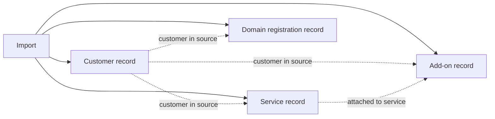

# Imported records: data model

This is the model used by **Import review**. It stores what another system reported so we can inspect it before a migration. Customer logins, the product catalog, invoices and live service management will need their own operational model. The accepted [service and component model](service-model.md) explains subscriptions, optional components and independent providers.

## Relationships

Solid arrows mean the records are stored within one import. Dashed arrows are relationships reported by the source. We keep missing or inconsistent links so they can be reviewed. Every lookup stays within the same import.

| Record   | Relationships                                                                                                                  |
| -------- | ------------------------------------------------------------------------------------------------------------------------------ |
| Customer | Groups services, add-ons and domain registrations. A customer's record is separate from a person's login.                      |
| Service  | Names its customer. For example, one customer's hosting plan.                                                                  |
| Add-on   | Names its customer and, when known, the service it attaches to. For example, storage attached to a particular hosting service. |
| Domain   | Names its customer. A domain registration is separate from a hostname on a hosting service.                                    |

The sample **Storage add-on** belongs to `customer-elm` and attaches to service `hosting-elm`. Its own source record ID is also `hosting-elm`; the record type distinguishes the two records. This demonstrates why an ID alone is insufficient.

An unknown attached service displays **Unknown**. A reference to a missing customer or service produces a data issue. An add-on and its attached service naming different customers also produces a data issue. The imported records remain unchanged. This is review evidence, and must be reconciled before creating operational services.

## Dates and times

| Name                         | Meaning                                                                                                     | Stored now? |
| ---------------------------- | ----------------------------------------------------------------------------------------------------------- | ----------- |
| `dataAsOf` / `data_as_of`    | When the source records were captured, as stated in the import file. Shown as **Data as of**.               | Yes         |
| `importedAt` / `imported_at` | When Datapad first accepted an import. Useful for import audit history.                                     | No          |
| `createdAt` / `created_at`   | When a particular entity was created. Source creation and Datapad creation would need distinct definitions. | No          |
| `updatedAt` / `updated_at`   | When a mutable entity last changed. Imports are immutable.                                                  | No          |

For example, records captured on October 1 can be imported on October 3. Labeling their capture time “Imported at” would give the wrong date. Snake case in SQL and camel case in the API are naming conventions; neither determines what a timestamp means.

A future import timestamp should be assigned by Datapad, excluded from the source-content digest and preserved when the same file is imported again. Future operational records can have creation and update timestamps with explicit meanings.

Due dates, next-invoice dates and domain expiry dates are separate calendar dates. They stay unchanged across time zones.

## Storage and identity

There are four tables: `imports`, `import_customers`, `import_services` and `import_domains`. Services and add-ons share a table and have different record types. Source is an identifier on the import, with no separate source table.

A record is identified by its import, record type and source record ID. An import is uniquely identified by its source and source reference. `sourceId` identifies the source system; `sourceRecordId` identifies a record within that system. Reimporting identical content does nothing; changing content under the same reference is rejected.

Raw records are preserved as JSON. Selected columns support lookups and data-issue checks; both are written in the same transaction. Import foreign keys enforce containment. Customer and service references deliberately allow missing records so the review can show source problems. Operational tables will need stronger ownership and relationship guarantees.

Status and date interpretations are also stored for issue queries. If those interpretation rules change, existing imports must be reconsidered so stored checks and displayed interpretations stay consistent.

See the [glossary](../CONTEXT.md) for business terms, the [architecture guide](import-review.md) for module boundaries and API field mappings, and the [Drizzle schema](../src/import-review/internal/schema.ts) for exact database columns.
