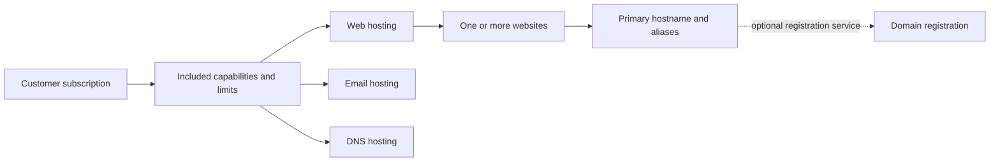

# Service packages and components

Accepted design for the operational portal. The current application only reviews imported records; it does not implement these subscriptions, controls or staff workflows. See the [import model](data-model.md) for what exists today.

## What a customer buys and uses

A package can include web hosting, email hosting and DNS hosting. Each included component can be used independently. Domain registration remains a separate service with its own renewal lifecycle, even when its price is bundled.

| Concept           | Meaning                                                                                                                               |
| ----------------- | ------------------------------------------------------------------------------------------------------------------------------------- |
| Package           | The offered combination of services, limits and pricing.                                                                              |
| Subscription      | The customer's recurring agreement for an offering.                                                                                   |
| Entitlement       | What that customer is allowed to use under their purchase or subscription.                                                            |
| Component         | An independently configurable capability, such as web, email or DNS hosting.                                                          |
| Requested setting | What the customer or authorized staff wants enabled or disabled.                                                                      |
| Provider state    | What the provider is confirmed to be delivering, with the time it was checked. It can differ while a change is pending or has failed. |
| Provider          | Where a service runs.                                                                                                                 |
| Manager           | Who administers it, such as the customer or service-provider staff.                                                                   |

For example, a customer pays for a package including web, email and DNS, uses the included web and DNS, and uses an external email provider. Their included email entitlement remains available. Disabling the included email component does not automatically reduce the package price. A separately billed add-on requires an explicit billing change to cancel its charge. An included component can have no separate charge or add-on record. Imported add-on records alone do not establish operational entitlements.

External hosting and staff management can coexist. Record provider and manager for each service or resource, rather than assuming every service on an account has the same arrangement. An external arrangement does not prove that an included local component has stopped running; provider state must be checked.

## Websites, names and related services

The diagram shows business relationships, not a database schema. Email and DNS also use domain names independently of websites. A DNS zone may cover a domain or delegated subdomain. A registration can exist without hosting; websites and email can use domains registered elsewhere. Multiple website aliases can serve the same website, while multiple websites have separate content. A provider alias may also configure mail or DNS; adapters must keep those effects explicit.

A **hosting account** is the provider container for hosted resources. Some providers call this a subscription; keep it distinct from the customer's commercial subscription. A hosting account may supply several components. Sharing that account does not combine their billing, requested settings or data lifecycle. Where the provider exposes separate web and email settings, use those targeted operations. An add-on belongs to its specific service; changing it must respect that service's customer and resource limits.

## Component changes

Use precise actions: **Enable web hosting**, **Disable email hosting**, **Use an external email provider**, **Delete website data**, or **Cancel an add-on**. A generic on/off control cannot explain every consequence.

- A request changes the desired setting. Show pending or failed changes until the provider confirms the result; unknown provider state stays unknown. Keep when it was last checked and whether it has never been checked. Provider state that conflicts with the requested setting, or a package component running without its entitlement, requires review rather than automatic correction. An included component deliberately left disabled is normal.
- Disabling a component stops its delivery according to an explicit provider-specific policy. Deleting its data is a separate, explicit action with a defined retention policy.
- Moving a service to another provider requires a handoff. Check dependencies such as DNS delegation, DNSSEC, mail routing and verification records before stopping the old service.
- A web change must preserve retained email, DNS and registration services. Avoid provider-wide suspension or deletion when a narrower operation is required.
- Registration renewal and subscription cancellation are separate commercial actions. Record expiry, renewal responsibility and how renewal is paid. Neither follows automatically from a component's disabled setting. Explain renewal or transfer arrangements before ending a package that includes registration.
- Hosting-account suspension or termination must identify every affected resource. Nonpayment behavior requires an explicit billing policy; a component request does not authorize a whole-account action.
- Data retention must cover live data and backup expiry. Billing records have a separate retention policy; do not claim complete erasure while retained copies remain.

## First release: staff-assisted changes

Customers request changes through support. Authorized staff reviews the target service, permissions, dependencies, billing effects and data effects before acting. Record the requester, approval, action and verified result. Purchases and destructive actions need human approval; agents may read and propose changes.

If a provider cannot disable one component independently, staff must explain the available migration or reconfiguration options. Do not present a misleading toggle. Retention periods and provider-specific procedures must be decided before implementing each action.

Customer self-service can follow when these procedures are reliable. This decision does not introduce a provisioning engine, a generic workflow framework or new database tables in the import-review slice.
